# iTraveller

## 项目介绍

该移动端软件提供了一个可在线查询兴趣点、提供导航线路、智能路线推荐以及线上互动的平台。

## 安装步骤

1.下载Hbilder X，导入项目文件。

 

2.如果是第一次使用，需要先配置小程序ide的相关路径，才能运行成功。如下图，需在输入框输入微信开发者工具的安装路径。 若HBuilderX不能正常启动微信开发者工具，需要开发者手动启动，然后将uni-app生成小程序工程的路径拷贝到微信开发者工具里面

 

 

3.点击运行-->运行到小程序模拟器-->微信开发者工具即可进行软件体验及调试

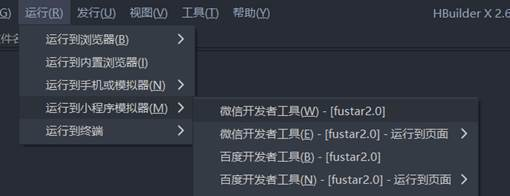 

## 系统架构

## 系统功能

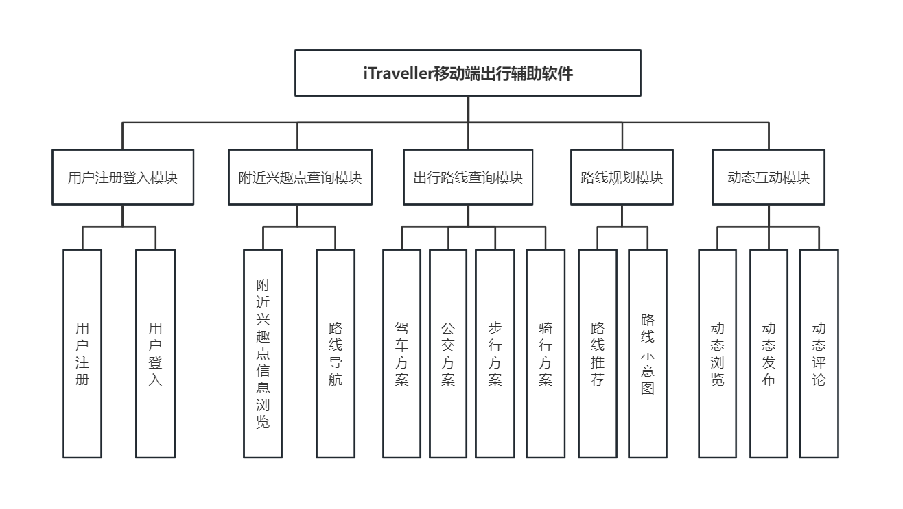

（1）附近兴趣点查询模块

根据用户的定位信息，该模块会首先显示用户附近存在的兴趣点信息，用户可通过点击地图上的兴趣点查看相关信息，或通过下方的图标查询附近相关的兴趣点，而后选择不同的出行方式以及出行方案进行路线导航。

（2）出行路线查询模块

该模块可通过输入的起点和终点进行出行路线方式和方案的查询。起点与终点的输入有三种方式：第一种是通过上方的输入框输入地点，下方会自动弹出与该关键字有关的提示，用户可点击下方的提示列表进行选择；第二种方式是点击“我的位置”按钮，该按钮会自动将自己所处的位置作为选择的地点；第三种方式是点击“地图选点”按钮，用户可在地图上进行地点的选择。同时，该模块下方可记录用户的历史搜索路线，供用户进行选择。

（3）路线规划模块

该模块通过蚁群算法为用户推荐适合的旅游方案，帮助用户节约交通、时间成本。用户只需要在该模块的页面中输入相应的起始点（兴趣点）即可，系统推荐相应路线后用户可在地图上查看路线图。

（4）动态发布模块

该模块下用户可将自己感兴趣或想知道的内容以话题的形式发布到APP中，可搭配图片进行描述。页面采用“论坛式”显示方式，用户在模块页面下可以通过上下滑动自由浏览自己或其他用户发布的“帖子”，排序模式上采用时间顺序。用户也能够通过页面下方“我的”按钮进入用户界面，查看自己的历史发布信息。

（5）动态浏览模块

该模块分为两个子界面，分别为推荐页面和话题页面，在推荐页面可以查看近期发布的热点话题及其相应回复，在话题界面可通过上方的话题专栏进行话题的选择，方便用户快速地查询感兴趣的信息。信息更新方式为实时，根据用户的网络情况而定，通常刷新后可见。

（6）动态详情模块

该模块可查看动态的详细信息，包括动态详情与回复，同时用户可在该界面点击回复按钮对该话题进行回复，对赞同的回复可进行点赞操作。

## 核心功能算法

### 蚁群算法简介

蚁群算法(Ant Colony Algorithm)是一种模拟蚂蚁觅食行为的模拟优化算法，它是由意大利学者Colorni等人于二十世纪九十年代初期首先提出，并首先使用在解决TSP（旅行商问题）上。

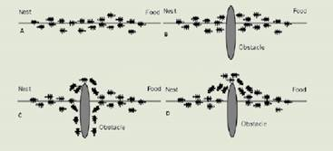

### 实现步骤

基于上述原理，将蚁群算法应用于解决TSP问题一般需要以下几个步骤，如图所示

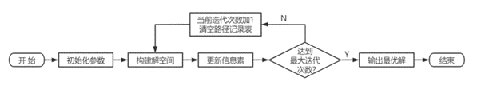

蚊群算法解决TSP问题基本步骤：

1.初始化参数。在算法开始前，对相关参数进行初始化，例如信息素释放总量Q、信息素重要程度因子α、启发函数重要程度因子β、信息素挥发因子ρ、蚁群规模(蚂蚁数量)m、迭代次数初值iter以及最大迭代次数iter_max。

2.构建解空间。在不同的出发点上随机放上蚂蚁，使每个蚂蚁都有相应的出发点，计算每个蚂蚁i(i=1，2，...，m)的下一个待经过的城市，直到所有蚂蚁访问完所有的城市。

3.更新信息素。把每个蚂蚁经过的路径长度Li(i=1，2，..，m)计算出来，并将当前迭代次数中的最优解(最短路径)记录下来。同时，更新两城市之间路径上的信息素浓度。

4.判断是否终止。当iter<iter_max，则iter=iter+ 1，清空蚂蚁经过路径的记录表，并返回到步骤2；否则，终止计算，输出最优解。

> 算法细节参考文章：[蚁群算法在路线规划中的应用及其系统实现](https://kns.cnki.net/kcms2/article/abstract?v=3uoqIhG8C44YLTlOAiTRKibYlV5Vjs7i8oRR1PAr7RxjuAJk4dHXoqjx2f-fX44fhNprDA9kVZYlZCe3Aa99pQvOTqIJdWyH&uniplatform=NZKPT)

## 功能截图

### 软件登录界面

<table>
    <tr style="float:left">
        <td></td>
        <td></td>
    </tr>
</table>

### 附近兴趣点查询模块

<table>
    <tr>
        <td>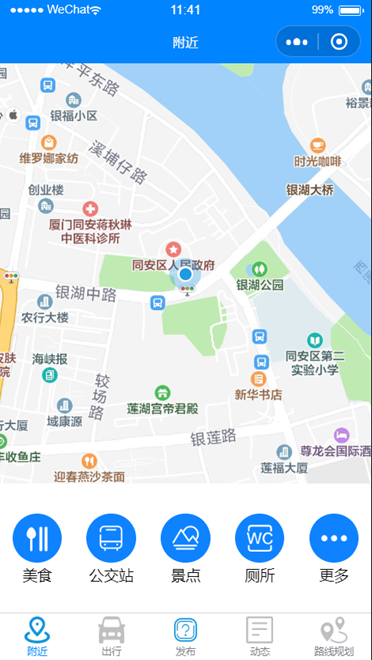</td>
        <td>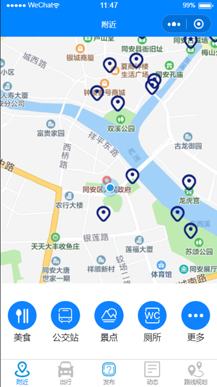</td>
        <td>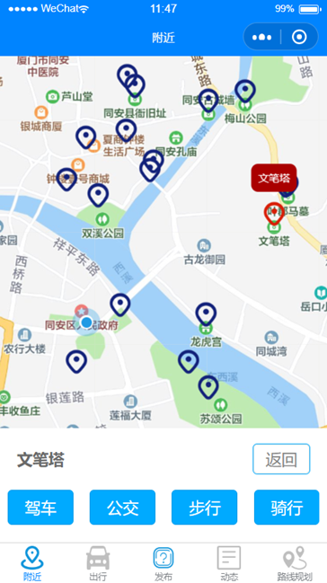</td>
    </tr>
    <tr>
        <td>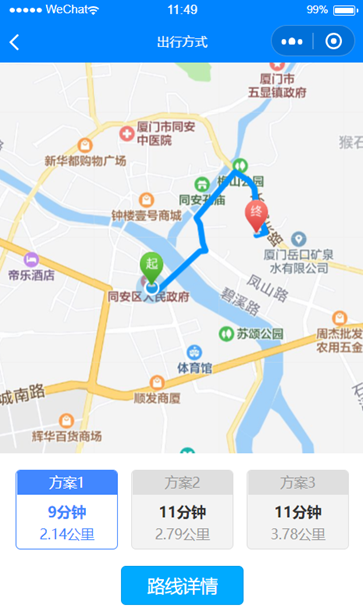</td>
        <td>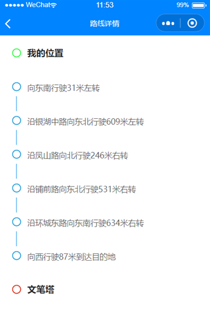</td>
    </tr>
</table>

### 出行路线查询模块

<table>
    <tr>
        <td></td>
        <td>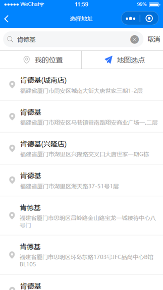</td>
        <td>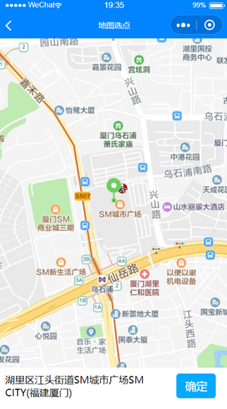</td>
    </tr>
    <tr>
        <td>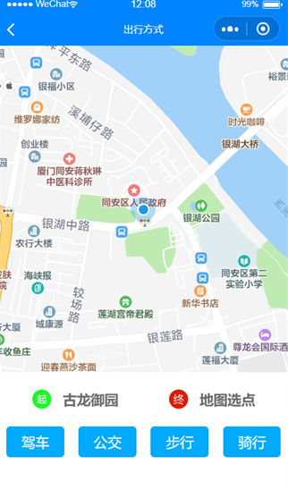</td>
        <td>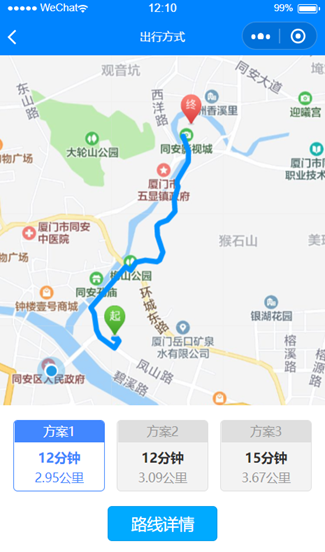</td>
    </tr>
</table>

### 路线规划模块

<table>
    <tr>
        <td></td>
        <td>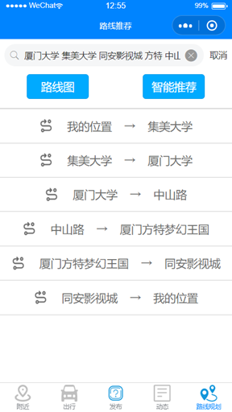</td>
        <td>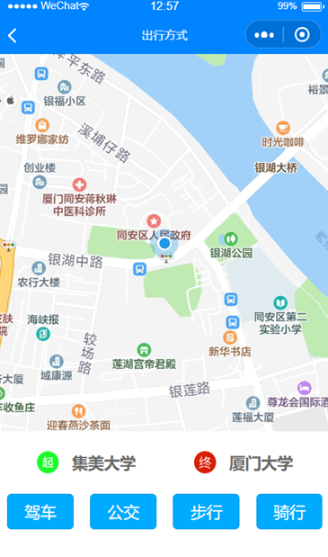</td>
    </tr>
    <tr>
        <td>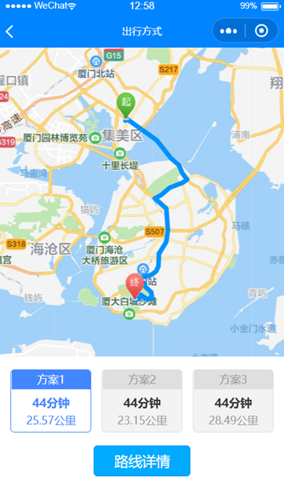</td>
        <td>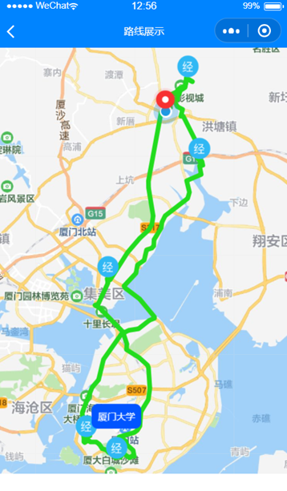</td>
    </tr>
</table>

### 发布话题

<table>
    <tr>
        <td></td>
        <td></td>
        <td></td>
    </tr>
</table>

### 动态浏览

<table>
    <tr style="float:left">
        <td></td>
        <td></td>
    </tr>
</table>

### 动态详情

<table>
    <tr style="float:left">
        <td>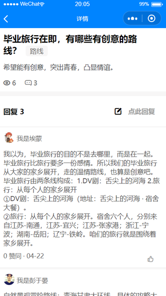</td>
        <td></td>
    </tr>
</table>

